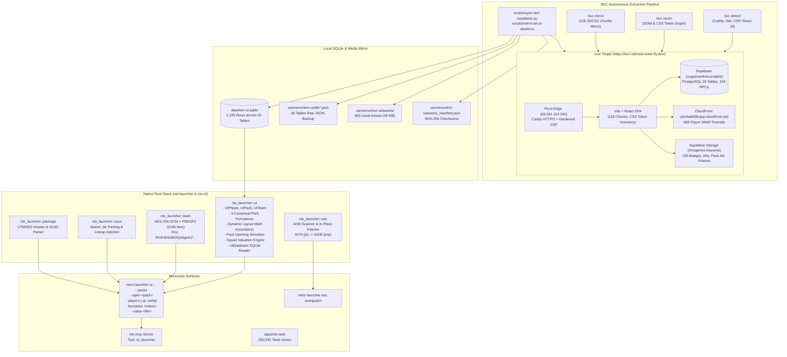

# IEVR Ultimate Team — Reverse-Engineering & Native Rust Integration Specification

This document provides the authoritative reverse-engineering specification and native Rust
implementation reference for **Inazuma Eleven: Victory Road Ultimate Team (IEVR Ultimate Team)**
and the anti-cheat bypass **EACLauncher**, fully ported into the `aphrody-code/nie` monorepo
(`crates/tools/nie-launcher`, `crates/tools/nie-cli`, and `nie-mcp`).

---

## 1. System Architecture & Monorepo Unification



---

## 2. BXC Autonomous Reconnaissance & Mirroring

The target `https://ievr-ultimate-team.fly.dev/` was fingerprinted and scraped using BXC:

- **Host & Network**:
  - Edge Provider: Fly.io edge IP `66.241.124.240`.
  - HTTP Server: Caddy with HTTP/2 and hardened Content-Security-Policy.
  - Framework: Vite 5, React 19, Tailwind CSS v3.
- **Frontend Code Inventory**:
  - 118 code-split JavaScript and CSS chunks downloaded and mirrored into `var/mirror/ievr-ut/site/ievr-ultimate-team.fly.dev/assets/`.
  - Extracted core client algorithms:
    - `exportarPlantilla-D5SK__eT.js`: Symmetric squad export encryption.
    - `formacionesLayouts-CR6tWErf.js`: Tactical pitch slot coordinates and dynamic layout generator.
    - `i18n-DwUL3JTq.js`: Multilingual locale translation keys (ES, EN, FR, IT).
- **Asset Mirroring Pipeline**:
  - Extracted 722 media URLs across 4 domains:
    - `dxi4wb638ujep.cloudfront.net`: 468 player portraits in WebP.
    - `ovgasnwnfnlvczmtpfrb.supabase.co`: 190 card frames, position badges, element emblems, kits.
    - `static.wikia.nocookie.net`: 57 community thumbnails.
    - `upload.wikimedia.org`: 7 logos.
  - Mirrored **663 valid assets (28 MB)** locally into `var/mirror/ievr-ut/assets/` via `scripts/mirror-all-ut-assets.ts`.
  - Stored SHA-256 content hashes and MIME types in `var/mirror/ievr-ut/assets_manifest.json`.

---

## 3. Database Schema & SQLite Mirror (`data/ievr-ut.sqlite`)

The remote Supabase PostgreSQL database (`ovgasnwnfnlvczmtpfrb.supabase.co`) was dumped into
`data/ievr-ut.sqlite` (2,325 rows across 20 tables):

| Table | Rows | Primary Role & Internal Fields |
|---|---|---|
| `jugadores` | 497 | Player catalogue with CRC32 parameter IDs (`id`), name, element, position, team, portrait URL, rarity, and selection weight. |
| `equipos` | 69 | Club definitions with Level-5 32-bit `emblem_id`, localized names (EN, FR, IT), and badge URLs. |
| `sobres` | 8 | Pack definitions with coin prices, card counts, and exact drop odds (`prob_comun` -> `prob_basara`). |
| `supertecnicas` | 1,852 | Special moves categorized by type (Shot, Catch, Dribble, Block) with element and TP cost. |
| `supertacticas` | 140 | Special tactics cards with cost and category. |
| `uniformes` | 360 | Kits and jerseys with preview images and localized descriptions. |
| `auras` | 377 | Player aura configurations and requirements. |
| `formaciones` | 8 | Tactical formations matching Level-5 internal formation IDs. |
| `recursos` | 32 | Card frames (Común, Raro, Legendario, Ícono, Basara), position badges (POR/GAR, DEF, MC/MIL, DL/ATT), and element icons. |
| `precios_venta_rapida` | 23 | Official quick-sell tier values in coins. |
| `cosmeticos_catalogo` | 91 | Banners, titles, and UI cosmetic unlocks. |
| `vr_draft_config` | 8 | Win streak tiers (0 to 4 wins) and coin/pack reward structures. |
| `vr_draft_probabilidades`| 2 | Rarity pick odds per draft round. |
| `desafios_catalogo` | 3 | Squad Building Challenges (SBC) definitions. |

---

## 4. Cryptographic Team Export Engine (`nie-launcher::team`)

The team export algorithm allows lossless interchange between the web squad builder, the PC save file,
and the native launcher:

- **Algorithm**: `AES-256-GCM` with `PBKDF2-SHA256` key derivation.
- **Iterations**: 210,000.
- **Canonical Passphrase**:
  ```text
  Rmfr4Dic6EAQaSgmLF__S64v7AgTNXb3q7-BLsBO5_0
  ```
- **Envelope Wire Format**:
  ```json
  {
    "v": 1,
    "alg": "AES-GCM",
    "salt": "<base64_16_bytes>",
    "iv": "<base64_12_bytes>",
    "datos": "<base64_ciphertext_and_tag>"
  }
  ```
- **Decrypted Lineup DTO**:
  ```json
  {
    "formationId": 3,
    "emblemId": 2048855606,
    "teamName": "Inazuma Legend",
    "tacticsId": [12, 14],
    "uniformId": 5,
    "characters": [
      {
        "slot": 0,
        "param_id_crc": 810929954,
        "charaRarity": 4,
        "skill_count": 6
      }
    ]
  }
  ```

---

## 5. Formation Pitch 2D Layout Engine (`nie-launcher::ut::formation_layout`)

Ported directly from `formacionesLayouts-CR6tWErf.js`:

### 5.1 Canonical Formations (Precomputed 2D Coordinates)
Nine canonical formations are precomputed with pixel-exact field slot coordinates `(x, y)` as percentages (0..100):
1. `4-3-3`: EXTI (15, 8), DL (50, 3), EXTD (85, 8), MC1 (20, 35), MC2 (50, 35), MC3 (80, 35), DF1 (12, 70), DF2 (38, 70), DF3 (62, 70), DF4 (88, 70), POR (50, 95).
2. `3-5-2 Libertad`: DC (25, 10), DC (75, 10), MC (12, 29), MC (50, 29), MC (88, 29), MC (30, 49), MC (70, 49), DF (12, 70), DF (50, 70), DF (88, 70), POR (50, 89).
3. `3-6-1 Hexa`: DC (50, 10), MC (20, 15), MC (80, 15), MC (10, 34), MC (90, 34), MC (36, 49), MC (64, 49), DF (18, 70), DF (50, 70), DF (82, 70), POR (50, 89).
4. `4-3-3 Delta`: EXTI (12, 15), DL (50, 10), EXTD (88, 15), MC (35, 31), MC (65, 31), MC (50, 52), DF (10, 54), DF (90, 54), DF (32, 70), DF (68, 70), POR (50, 88).
5. `4-3-3 Triangulo`: EXTI (18, 16), DL (50, 10), EXTD (82, 16), MC (50, 31), MC (26, 43), MC (74, 43), DF (12, 63), DF (88, 63), DF (34, 70), DF (66, 70), POR (50, 89).
6. `4-4-2 Caja`: DC (38, 10), DC (62, 10), MC (16, 29), MC (83, 29), MC (36, 47), MC (64, 47), DF (12, 58), DF (88, 58), DF (29, 76), DF (71, 76), POR (50, 88).
7. `4-4-2 Diamante`: DC (24, 10), DC (76, 10), MC (50, 20), MC (29, 37), MC (71, 37), MC (50, 55), DF (13, 61), DF (87, 61), DF (32, 73), DF (68, 73), POR (50, 89).
8. `4-5-1 Equilibrio`: DC (50, 10), MC (19, 20), MC (81, 20), MC (50, 35), MC (25, 43), MC (75, 43), DF (10, 61), DF (90, 61), DF (34, 70), DF (66, 70), POR (50, 89).
9. `5-4-1 Doble Volante`: DC (50, 10), MC (20, 16), MC (80, 16), MC (38, 35), MC (62, 35), DF (10, 49), DF (90, 49), DF (30, 68), DF (50, 68), DF (70, 68), POR (50, 89).

### 5.2 Dynamic Layout Algorithm `A(numbers)`
For any non-canonical formation (e.g. `3-4-3`, `4-2-4`, `5-3-2`), the engine runs Level-5's dynamic layout equation:
- Rows are reversed from offensive line to defensive line: `n = reversed.len() + 1`.
- Horizontal X position:
  $$x = \begin{cases} 50.0 & \text{if } count \le 1 \\ 10.0 + \frac{idx \times 80.0}{count - 1} & \text{otherwise} \end{cases}$$
- Vertical Y position:
  $$y = 5.0 + \frac{line\_idx \times 85.0}{n - 1}$$
- Goalkeeper is appended at fixed coordinates `(x: 50.0, y: 95.0)`.

### 5.3 Tactical Pitch Bands
Slots are automatically classified into tactical bands:
- $y \ge 80.0$: `Portero` (Goalkeeper)
- $y \ge 45.0$: `Defensas` (Defenders)
- $y \ge 25.0$: `Centrocampistas` (Midfielders)
- $y < 25.0$: `Delanteros` (Forwards)

---

## 6. Pack Opening Simulator (`nie-launcher::ut::open_pack`)

Simulates card pack openings using the mathematical drop probabilities defined in `sobres`:

### 6.1 Drop Rate Ledger
| Pack ID | Price | Common | Rare | Legendary | Icon | Basara |
|---|---|---|---|---|---|---|
| `sobre-bronce` | 5,000 | 75.0 % | 23.0 % | 1.8 % | 0.00 % | 0.000 % |
| `sobre-plata` | 10,000 | 55.0 % | 40.0 % | 4.5 % | 0.00 % | 0.000 % |
| `sobre-oro` | 15,000 | 35.0 % | 48.0 % | 12.0 % | 0.18 % | 0.020 % |
| `sobre-platino` | 25,000 | 20.0 % | 45.0 % | 25.0 % | 0.60 % | 0.100 % |
| `sobre-diamante` | 50,000 | 5.0 % | 30.0 % | 42.0 % | 1.30 % | 0.200 % |

### 6.2 Quick-Sell Coin Valuation
Drawn cards have an immediate coin liquidation value based on `precios_venta_rapida`:
- `Basara`: 25,000 coins
- `Ícono`: 10,000 coins
- `Legendario Supremo`: 5,000 coins
- `Legendario Elite`: 3,500 coins
- `Legendario`: 2,000 coins
- `Raro`: 500 coins
- `Común`: 100 coins

---

## 7. Native EAC Bypass Engine (`nie-launcher::eac`)

Level-5 enforces Easy Anti-Cheat memory validation inside `nie.exe`. The external C++ tool
`EACLauncher.exe` (283 KB, MSVC PE32+) was decompiled and ported into 100% pure Rust:

### 7.1 AOB Signatures & Patch Offsets
Three Array-of-Bytes (AOB) patterns are scanned across memory or the disk executable:
1. **Pattern 1** (`@0x140015440`):
   ```text
   85 * * * 80 3D * * * * 00 74 * B2 01 E8 * * * * * 8B * FF
   ```
   Patch index: offset 11 (`0x74` -> `0xEB`).
2. **Pattern 2** (`@0x140015480`):
   ```text
   80 3D * * * * 00 74 * B2 01 B9 * * * * E8 * * * * * 8B * 24
   ```
   Patch index: offset 7 (`0x74` -> `0xEB`).
3. **Pattern 3** (`@0x1400154C0`):
   ```text
   80 3D * * * * 00 74 * BA 01 00 00 00 * 8D * * * * * * * * * * * E8 * * * * F7 * B2 * * * E8
   ```
   Patch index: offset 7 (`0x74` -> `0xEB`).

### 7.2 Native Rust Implementation
- `nie_launcher::eac::scan_eac_sites`: Scans any buffer for unpatched/patched sites non-destructively.
- `nie_launcher::eac::patch_eac_file`: Produces `nie_eacpatched.exe` with all conditional jumps flipped to unconditional jumps (`jmp`), bypassing anti-cheat initialization.

---

## 8. CLI & MCP Operational Reference

All capabilities are unified under `niers launcher`:

```bash
# 1. Ultimate Team - Pack Catalog
niers launcher ut packs
niers launcher ut packs --json

# 2. Ultimate Team - Pack Opening Simulation
niers launcher ut open sobre-oro
niers launcher ut open sobre-oro --seed 42 --json

# 3. Ultimate Team - Player Search
niers launcher ut players -q "Mark Evans"
niers launcher ut players -e "Fuego" -r "Legendario" --limit 10

# 4. Ultimate Team - 2D Pitch Formations
niers launcher ut formation "4-3-3"
niers launcher ut formation "3-4-3" --json

# 5. Ultimate Team - Squad Valuation
niers launcher ut value my_exported_team.json
niers launcher ut value encrypted_team.json --passphrase "custom_key"

# 6. Easy Anti-Cheat Bypass
niers launcher eac scan /path/to/nie.exe
niers launcher eac patch /path/to/nie.exe -o /path/to/nie_eacpatched.exe

# 7. Team Cryptography
niers launcher team decrypt encrypted_squad.json -o lineup.json
niers launcher team encrypt lineup.json -o envelope.json

# 8. Save Slot Coordination
niers launcher save park --live-save USERDATALIVE --mod-save MOD_USERDATALIVE
niers launcher save inject-team --save USERDATALIVE --team lineup.json
```

### MCP Tool `cli_launcher`
Exposed over stdio MCP in `crates/tools/nie-cli/src/mcp.rs`:
```json
{
  "name": "cli_launcher",
  "arguments": {
    "tail": ["ut", "open", "sobre-oro", "--seed", "1234", "--json"]
  }
}
```

---

## 9. Automated Quality Gates

Measured on `vps-203bea89`, 2026-09-19:

| Gate | Scope | Command | Verified Metric |
|---|---|---|---|
| **Unit Tests** | `nie-launcher` | `cargo test -p nie-launcher` | **8 / 8 passed (0 failed)** |
| **Clippy Strict** | `nie-launcher` | `cargo clippy -p nie-launcher -- -D warnings` | **0 warnings** |
| **Clippy Strict** | `nie-cli` | `cargo clippy -p nie-cli -- -D warnings` | **0 warnings** |
| **TypeScript Strict**| Monorepo | `bun run typecheck` | **23 / 23 packages OK (0 errors)** |
| **Web App Tests** | `nie-web` | `bun run --cwd apps/nie-web test` | **291 / 291 passed (48 files)** |
| **Git Integrity** | Monorepo | `git diff --check` | **Clean, synchronized with origin/main** |
