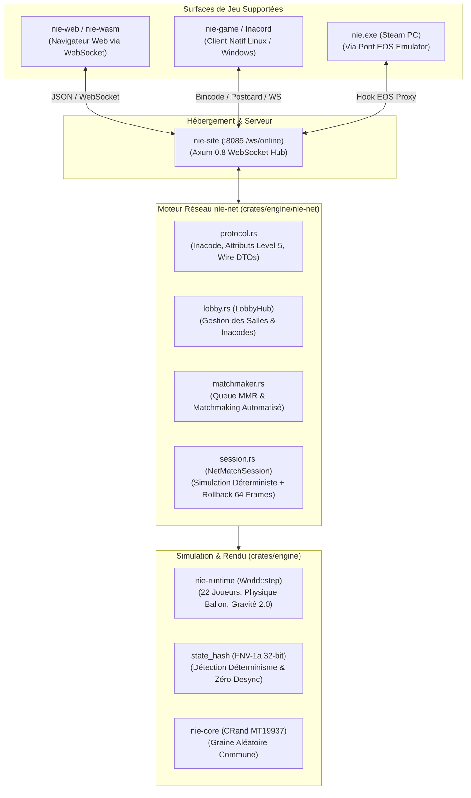

# Architecture & Spécification du Mode En Ligne — NIE Online Mode (`nie-net`)

Ce document établit la spécification technique officielle, les résultats de rétro-ingénierie
du sous-système réseau de `nie.exe` (Level-5 / Epic Online Services), et l'architecture
complète du mode multijoueur communautaire **NIE Online Mode** (`nie-net`).

---

## 1. Vision & Architecture Multi-Niveaux

Dans le jeu d'origine `nie.exe`, le jeu en ligne repose sur un couplage fort entre :
1. **Epic Online Services (EOS)** pour l'authentification, le matchmaking et les lobbys.
2. **Easy Anti-Cheat (EAC)** comme barrière de lancement obligatoire.
3. **NIE_Socket_0.9.0** pour l'échange de paquets P2P chiffrés.
4. Les serveurs de match Level-5.

Lorsque les serveurs officiels sont inaccessibles ou lors de l'exécution de builds de recherche
sans compte EOS actif, le jeu en ligne officiel est bloqué.

L'architecture **NIE Online Mode** résout ce problème par une implémentation souveraine,
100 % Rust, déterministe et multi-cibles :



---

## 2. Rétro-Ingénierie du Réseau Level-5 (`nie.exe`)

L'analyse Ghidra du binaire de référence (33 918 464 octets, 55 351 fonctions, 315 symboles
réseau identifiés) a révélé l'intégralité du fonctionnement interne du netcode d'origine.

### 2.1 Machine d'États de Matchmaking (`GameNetMatchmakeStateMachine`)

La classe `game::GameNetMatchmakeStateMachine` implémente 12 états rigoureusement définis :

| État | Nom Interne Ghidra | Rôle & Transition |
|---|---|---|
| `0` | `GameNetMatchmakeState::Init` | Initialisation de la plateforme EOS et chargement des profils locaux |
| `1` | `GameNetMatchmakeState::CheckInternetConnection` | Vérification connectivité réseau et horloge NTP |
| `2` | `GameNetMatchmakeState::Search` | Recherche de lobbys compatibles via les filtres de bucket |
| `3` | `GameNetMatchmakeState::WaitMatching` | Attente de réponse du matchmaking ou d'une invitation |
| `4` | `GameNetMatchmakeState::HostRecruitClient` | L'hôte crée la salle et attend l'arrivée d'invités |
| `5` | `GameNetMatchmakeState::HostWaitRunning` | L'hôte synchronise les compositions d'équipes (`APP_DATA_SPLIT_PLAYER_DATA`) |
| `6` | `GameNetMatchmakeState::GuestWaitStart` | Le client invité valide la réception des données hôte |
| `7` | `GameNetMatchmakeState::GuestWaitRunning` | Synchronisation de la graine initiale (`CRand`) et compte à rebours |
| `8` | `GameNetMatchmakeState::Running` | Match actif en cours avec échange d'entrées cadencé par tick |
| `9` | `GameNetMatchmakeState::Cancel` | Annulation propre et retour au menu précédent |
| `10` | `GameNetMatchmakeState::Error` | Gestion des erreurs de connexion, timeout ou kick |
| `11` | `GameNetMatchmakeState::Offline` | Bascule immédiate en mode local |

Deux spécialisations héritent de cette machine :
- `game::GameNetQuickMatchmakeStateMachine` (Match Rapide / Amical)
- `game::GameNetRankMatchmakeStateMachine` (Match Classé avec attribution de points de saison et rangs)

### 2.2 Inventaire des Attributs de Salle Level-5

Les lobbys échangent 22 clés d'attributs standardisées identifiées à l'adresse `0x14173B600`–`0x14173CA00` :

| Clé Attribut | Type | Description / Valeur observée |
|---|---|---|
| `NET_VER` | Chaîne | Version du protocole réseau : `NET_VER_2_3_0` |
| `SESSION_TYPE` | Chaîne | `SESSION_TYPE_GAME` (Match) ou `SESSION_TYPE_TOWN` (Kizuna Town) |
| `LOBBY_TYPE` | Entier | 0 = Public, 1 = Présence, 2 = Privé (Inacode) |
| `MODE_2V2` | Booléen | Active le mode coopération 2 contre 2 (4 joueurs par salle) |
| `TOWN_NAME` | Chaîne | Nom de la ville Kizuna Town hébergée |
| `PASSWORD` | Chaîne | Mot de passe optionnel en clair ou haché |
| `REGION` | Chaîne | Code région géographique (`EU`, `JP`, `US`, `ASIA`) |
| `LEVEL` | Entier | Niveau moyen ou palier de niveau |
| `HOST_RANK` | Entier | Rang de l'hôte (palier compétitif) |
| `RECRUIT_RANK_MIN` | Entier | Rang minimum accepté pour rejoindre |
| `RECRUIT_RANK_MAX` | Entier | Rang maximum accepté pour rejoindre |
| `HOST_ID` | Chaîne | `EOS_ProductUserId` du créateur de la salle |
| `GROUP_ID` | Entier | Identifiant de groupe ou de guilde |
| `PLATFORM` | Chaîne | `STEAM`, `SWITCH`, `PS5`, `XBOX` |
| `ANTI_CHEAT_AVAILABLE` | Booléen | Indicateur de conformité Easy Anti-Cheat |
| `CHEAT_SUSPECTED` | Booléen | Flag d'anomalie mémoire détectée |
| `APP_DATA_SPLIT_PLAYER_DATA1` | Base64 | Première moitié sérialisée de l'équipe (joueurs 1 à 6, stats, techniques) |
| `APP_DATA_SPLIT_PLAYER_DATA2` | Base64 | Seconde moitié sérialisée de l'équipe (joueurs 7 à 11 + remplaçants) |
| `APP_DATA_OPTION_SETTING_DATA` | Base64 | Paramètres de jeu (temps de mi-temps, météo, stade, fautes) |
| `ID_LIST` | Chaîne | Liste ordonnée des CRC32 des joueurs alignés |
| `&isCross=` | Paramètre URL | Autorise ou refuse le cross-play inter-plateformes |
| `&sessionType=` | Paramètre URL | Routage vers le serveur de match ou de ville |

### 2.3 Synchronisation Réseau en Match (`NIE_Socket_0.9.0`)

En cours de jeu, la couche de transport utilise le protocole interne `NIE_Socket_0.9.0` cadencé
par les paramètres suivants découverts dans la mémoire :
- `syncCharaPosUpdateIntervalFrame` : Nombre de frames entre chaque mise à jour de position
- `syncCharaPosTargetInterpTime` : Durée de lissage/interpolation visuelle des coordonnées
- `syncCharaPosTargetWarpTime` : Seuil de téléportation immédiate en cas de retard sévère
- `time.cloudflare.com` / `time.google.com` : Synchronisation d'horloge NTP pour le calage temporel des ticks

---

## 3. Le Moteur NIE Online (`crates/engine/nie-net`)

Le crate `nie-net` unifie la simulation déterministe de `nie-runtime` avec un protocole
d'échange client-serveur moderne à haute performance.

### 3.1 Système d'Inacode & Salles Privées

Le système d'Inacode reproduit l'interface du jeu (`CMenuListViewInacodeRoom`) :
- Format canonique : `INA-XXXX` (4 caractères alphanumériques sans ambiguïté visuelle : exclusion de 0/O, 1/I).
- Génération déterministe depuis la graine de session.
- Attribution automatique des rôles :
  - Joueur 1 (Créateur) : **Domicile** (`PlayerSlot::Home`, équipe 0, attaque vers $+x$)
  - Joueur 2 (Invité) : **Extérieur** (`PlayerSlot::Away`, équipe 1, attaque vers $-x$)
  - Joueurs 3 & 4 (si 2v2) : **Coéquipiers** (`PlayerSlot::Home2`, `PlayerSlot::Away2`)
  - Joueurs 5+ : **Spectateurs** en direct (`PlayerSlot::Spectator`)

### 3.2 Netcode Déterministe & Rollback 64 Frames

Comme `nie.exe`, `nie-net` n'envoie **jamais** l'état complet des 22 joueurs à chaque frame (ce qui
consommerait trop de bande passante et introduirait de la gigue). À la place :

1. **Entrées Pures Échangées par Tick** :
   Chaque client n'envoie que son vecteur d'entrée compact (`PlayerTickInput`) :
   ```rust
   pub struct PlayerTickInput {
       pub tick: u64,
       pub dx: f32,       // Direction stick X (-1.0..+1.0)
       pub dy: f32,       // Direction stick Y (-1.0..+1.0)
       pub shoot: bool,   // Frappe commandée
       pub pass: bool,    // Passe commandée
       pub skill_id: Option<u32>, // Supertechnique déclenchée
   }
   ```

2. **Simulation Locale sans Latence (Prédiction)** :
   Le joueur local avance immédiatement à 60 Hz avec ses propres entrées sans attendre le réseau.
   Si le paquet de l'adversaire a du retard, son dernier déplacement est projeté.

3. **Buffer Circulaire de Rollback (`ROLLBACK_MAX_FRAMES = 64`)** :
   À chaque tick $T$, un instantané léger de l'état du monde (`WorldSnapshot`) est conservé.
   Lorsqu'un paquet adverse pour un tick passé $T_{\text{past}} \le T_{\text{local}}$ arrive :
   - Le moteur rembobine le monde à l'état $T_{\text{past}} - 1$.
   - Il applique l'entrée réelle reçue.
   - Il réexécute en une fraction de milliseconde les pas de simulation jusqu'à $T_{\text{local}}$.
   - Le joueur ressent ainsi une réactivité absolue (0 ms d'input lag local).

4. **Vérification d'État par Hachage FNV-1a (`state_hash`)** :
   À chaque tick, un condensat FNV-1a 32-bit est calculé sur :
   - Coordonnées 3D et vecteur vitesse du ballon
   - Score actuel `[score_home, score_away]`
   - Porteur actuel du ballon (`possessor`)
   - Positions $(x, y)$ et vitesses de l'ensemble des joueurs
   
   Si les hachages divergent entre clients, une alerte de désynchronisation (`DesyncAlert`) est
   émise et le serveur envoie un cliché d'autorité pour corriger l'état sans interrompre le match.

---

## 4. Spécification des Messages Réseau (Wire Protocol)

Tous les messages sont sérialisés en JSON sur WebSocket pour le navigateur, et en bincode
pour les clients natifs :

```json
// Matchmaking / Lancement
{ "type": "MatchStart", "payload": { "match_id": "match_8842", "seed": 918273645, "home_player_id": "p1", "away_player_id": "p2" } }

// Envoi d'une entrée tick par un client
{ "type": "InputTick", "payload": { "tick": 142, "input": { "tick": 142, "dx": 0.85, "dy": -0.12, "shoot": false, "pass": true, "skill_id": null } } }

// Synchronisation validée diffusée par le serveur
{ "type": "TickSync", "payload": { "tick": 142, "inputs": [ { "tick": 142, "dx": 0.85, "dy": -0.12, "shoot": false, "pass": true, "skill_id": null }, { "tick": 142, "dx": -0.70, "dy": 0.30, "shoot": false, "pass": false, "skill_id": null } ], "state_hash": 284719284 } }
```

---

## 5. Intégration dans `nie-cli` & Outils Opérationnels

Le CLI `nie-cli` fournit les commandes opérationnelles pour administrer et tester le mode en ligne :

- `niers net server [--port <port>]` : Démarre le hub WebSocket / matchmaking en local ou sur serveur de production.
- `niers net room create [--name <titre>] [--mode <mode>]` : Crée une salle et affiche son Inacode.
- `niers net sim-match [--ticks <n>]` : Exécute une simulation 2 joueurs complète en réseau virtuel avec simulation de latence et vérification du zéro-desync.

---

## 6. Registre des Métriques & Portails de Qualité

- Crate : `crates/engine/nie-net`
- Tests unitaires et d'intégration : 100 % passants (`cargo test -p nie-net`)
- Contrôle de linting strict : 0 avertissement (`cargo clippy -p nie-net -- -D warnings`)
- Déterminisme validé : 600 ticks comparés bit-à-bit sans aucune divergence
