# Spécification & Architecture Unifiée du Mode En Ligne — NIE Online Mode (`nie-net`)

Ce document constitue la référence canonique et exhaustive du sous-système multijoueur de **NIE**. Il réalise la **fusion architecturale et fonctionnelle complète** entre :
1. **L'infrastructure réseau native Level-5 reversée** (`nie.exe` / EOS / Inacode / Machine d'états à 12 phases / P2P deterministe).
2. **Le système e-sport et compétitif Achillea (Rose Griffon)** (11 Rangs Fer-Légendaire, ELO asymétrique directionnel, Tournois Double Élimination & Suisses, Clans, Challenges base-32, double validation des scores).
3. **L'écosystème IEVR Ultimate Team (FUT)** (Compositions chiffrées AES-256-GCM, Draft, Évaluation de cartes/clubs, Alchimie, Stades et Déploiement 2D).
4. **Le Métavers Social Kizuna Town & Kizuna Link** (Monde persistant, synchronisation des avatars, placement d'objets et de personnages, défis directs entre visiteurs).

---

## 1. Vue d'Ensemble & Topologie du Système

Le système est 100 % Rust, multi-plateforme (serveur natif Linux, client desktop Inacord, client WebAssembly navigateur `nie-web`) et élimine toute dépendance fermée aux serveurs d'authentification propriétaires.

```mermaid
flowchart TD
    subgraph Clients ["Surfaces Utilisateurs & Clients de Jeu"]
        Wasm["nie-web (WebAssembly)<br/>Navigateur Web via WebSocket"]
        Native["nie-game / Inacord (Desktop)<br/>Client Natif Linux / Windows"]
        Steam["nie.exe (Steam PC)<br/>Via nie-steam Emulator Hook"]
    end

    subgraph Transport ["Couche d'Accès & Transport (nie-site :8085)"]
        WsHub["/ws/online (Axum 0.8 WebSocket Hub)<br/>Échanges JSON / Bincode déterministes"]
        RestAPI["/api/v1/online & /api/v1/ut<br/>Catalogue, Équipes, Tournois, Clans"]
    end

    subgraph Core ["Moteur Multijoueur nie-net (crates/engine/nie-net)"]
        direction TB
        
        subgraph Level5_RE ["1. Couche Level-5 Native & Inacode"]
            L5_SM["state_machine.rs<br/>12 États EOS / Matchmaking Bucket"]
            L5_Room["rooms.rs & lobby.rs<br/>Inacodes INA-XXXX, Blacklist, Commentaires"]
            L5_Rollback["session.rs (Rollback 64 Frames)<br/>TickRate 60Hz, FNV-1a Hash, Zero-Desync"]
        end

        subgraph Achillea_Esport ["2. Moteur Compétitif Achillea (Rose Griffon)"]
            Ach_Elo["competitive.rs<br/>11 Rangs (Fer à Légendaire) & ELO Directionnel"]
            Ach_Tourn["tournament.rs<br/>Arbres Simple/Double Élim, Suisse, Points Circuit"]
            Ach_Ranked["ranked.rs<br/>ChallengeStore Base-32, Double Validation, Forfait"]
            Ach_Clan["clans.rs<br/>Rosters, Rôles, Tags [TAG], AP Saisonnie"]
        end

        subgraph FUT_Ecosystem ["3. Écosystème Ultimate Team (UT)"]
            FUT_Squad["UtSquadSummary (protocol.rs)<br/>Note d'Équipe, Alchimie, Capitaine"]
            FUT_Crypto["AES-256-GCM + PBKDF2<br/>Partage sécurisé de compositions"]
            FUT_Inspect["Inspection de deck en Kizuna Town"]
        end

        subgraph Kizuna_Town ["4. Métavers Kizuna Town & Social"]
            Kiz_World["kizuna.rs & kizuna_link.rs<br/>Monde persistant, Déplacement 3D, Emotes"]
            Kiz_Build["Placement de Décors & PNJ Recrutés"]
            Kiz_Social["Notifications Popout, Chat, Défis Directs"]
        end
    end

    Clients <--> Transport
    Transport <--> Core
    Level5_RE <--> Achillea_Esport
    Achillea_Esport <--> FUT_Ecosystem
    FUT_Ecosystem <--> Kizuna_Town
```



---

## 2. Couche 1 : Ingénierie Inverse Level-5 & Machine d'États

### 2.1 Les 12 Phases de Matchmaking (`GameNetMatchmakeStateMachine`)
L'analyse de `nie.exe` (binaire de référence de 33 918 464 octets) à l'adresse `0x14173B600` documente les 12 états rigides reproduits dans [`state_machine.rs`](file:///home/ubuntu/nie/crates/engine/nie-net/src/state_machine.rs) :

| Phase | Nom Symbolique Ghidra | Rôle & Transition Réseau |
|:---:|:---|:---|
| `0` | `Init` | Initialisation de la plateforme EOS et chargement des profils locaux |
| `1` | `CheckInternetConnection` | Vérification connectivité réseau et synchronisation NTP (`time.cloudflare.com`) |
| `2` | `Search` | Recherche active de lobbys compatibles via les filtres de bucket |
| `3` | `WaitMatching` | Attente de réponse du matchmaking ou d'une invitation directe |
| `4` | `HostRecruitClient` | L'hôte réserve la salle Inacode et attend l'arrivée d'invités |
| `5` | `HostWaitRunning` | L'hôte transmet les compositions d'équipes (`APP_DATA_SPLIT_PLAYER_DATA1 & 2`) |
| `6` | `GuestWaitStart` | Le client invité valide la réception complète des données d'équipe |
| `7` | `GuestWaitRunning` | Synchronisation de la graine pseudo-aléatoire (`CRand` MT19937) et compte à rebours |
| `8` | `Running` | Match actif en cours avec échange d'entrées pures cadencé à 60 Hz |
| `9` | `Cancel` | Annulation propre de la file ou de la salle et libération des ressources |
| `10` | `Error` | Gestion unifiée des erreurs de connexion, timeout de paquets ou kick |
| `11` | `Offline` | Bascule sans interruption vers le moteur local |

### 2.2 Protocole d'Inacode (`CMenuListViewInacodeRoom`)
- Format canonique strict : `INA-XXXX` (4 caractères alphanumériques générés de façon pseudo-aléatoire depuis la graine de session).
- Alphabet sans ambiguïté : `23456789ABCDEFGHJKLMNPQRSTUVWXYZ` (exclusion formelle des glyphes confus `0`, `1`, `I`, `O`).
- Attribution déterministe des slots :
  - **Slot 0 (`Home`)** : Créateur de la salle (équipe domicile, attaque vers $+x$).
  - **Slot 1 (`Away`)** : Invité (équipe visiteur, attaque vers $-x$).
  - **Slots 2 & 3 (`Home2`, `Away2`)** : Coéquipiers en cas de mode coopération 2v2 (`MODE_2V2 = true`).
  - **Slots 4+ (`Spectator`)** : Spectateurs recevant le flux des ticks en direct.

### 2.3 Netcode Déterministe & Rollback 64 Frames
Comme dans `nie.exe`, aucune coordonnée brute des 22 joueurs n'est diffusée en cours de jeu.
1. **Entrées Pures par Tick (`PlayerTickInput`)** : Stick directionnel normalisé $(dx, dy)$, commandes d'actions (`shoot`, `pass`), et ID de Supertechnique déclenchée.
2. **Buffer Circulaire de 64 Ticks** : Chaque client simule immédiatement localement à 60 Hz sans latence perçue (0 ms d'input lag).
3. **Réconciliation Rollback** : À l'arrivée d'un paquet adverse avec latence, le monde recule à la frame concernée, intègre l'entrée réelle et rejoue instantanément les frames intermédiaires.
4. **Contrôle d'Intégrité FNV-1a (`state_hash`)** : À chaque frame, un condensat FNV-1a 32-bit de la physique (ballon, joueurs, score, possession) certifie l'absence absolue de désynchronisation. En cas d'écart, un paquet correcteur d'autorité (`StateCorrection`) rétablit la parité bit-à-bit.

---

## 3. Couche 2 : Le Moteur Compétitif Achillea (Rose Griffon)

### 3.1 Échelle des 11 Rangs & Progression Directionnelle Asymétrique
Le sous-système [`competitive.rs`](file:///home/ubuntu/nie/crates/engine/nie-net/src/competitive.rs) implémente les 11 rangs officiels du circuit compétitif :

| Index | Rang | Nom FR | Nom EN | Seuil AP | $K_{\mathrm{win}}$ | $K_{\mathrm{loss}}$ | Règle d'Équité |
|:---:|:---|:---|:---|:---:|:---:|:---:|:---|
| `0` | `Fer` | Fer | Iron | 0 | +20 | -5 | Protection débutant maximale |
| `1` | `Bronze` | Bronze | Bronze | 200 | +20 | -8 | Tolérance aux défaites |
| `2` | `Argent` | Argent | Silver | 400 | +20 | -10 | Transition vers le milieu de tableau |
| `3` | `Or` | Or | Gold | 600 | +20 | -12 | Progression standard |
| `4` | `Platine` | Platine | Platinum | 800 | +20 | -14 | Palier compétitif intermédiaire |
| `5` | `Diamant` | Diamant | Diamond | 1000 | +18 | -14 | Exigence accrue |
| `6` | `Émeraude` | Émeraude | Emerald | 1200 | +18 | -15 | Quasi-symétrie |
| `7` | `Rubis` | Rubis | Ruby | 1400 | +18 | -16 | Haut niveau compétitif |
| `8` | `Divin` | Divin | Divine | 1600 | +16 | -16 | Stricte symétrie $\pm 16$ |
| `9` | `Supernova` | Supernova | Supernova | 1800 | +16 | -16 | Élite mondiale |
| `10` | `Légendaire` | Légendaire | Legendary | 2000+ | +16 | -16 | Rang suprême du ladder |

L'espérance mathématique est calculée selon :
$$E_A = \frac{1}{1 + 10^{(R_B - R_A) / 400}}, \quad E_B = 1 - E_A$$
Les gains/pertes d'Activity Points ($\Delta \mathrm{AP}$) appliquent le facteur directionnel du palier :
$$\Delta \mathrm{AP}_A = \mathrm{round}(K_{\mathrm{direction}} \times (S_A - E_A))$$

### 3.2 Système de Défis Instantanés (`ChallengeStore`)
Pour organiser des matchs de tournoi ou des défis sans passer par la recherche publique :
- **Codes de défi Base-32 de 8 caractères** (`ABCDEFGHJKLMNPQRSTUVWXYZ23456789`).
- **TTL de 30 minutes** avec purge automatique des liens expirés.
- **Consommation unique sécurisée** : invalidation atomique dès que les deux joueurs rejoignent la salle.

### 3.3 Matchmaking Dynamique & Fenêtre d'Élargissement ELO
Dans la file d'attente automatisée (`ranked.rs`) :
$$\mathrm{Window}(t) = W_{\mathrm{base}} + \left\lfloor \frac{t_{\mathrm{attente}}}{5000\,\mathrm{ms}} \right\rfloor \times 50\,\mathrm{AP}$$
- Recherche initiale bornée à $\pm 100\,\mathrm{AP}$.
- Élargissement dynamique de $+50\,\mathrm{AP}$ toutes les 5 secondes pour garantir un appariement rapide sans compromettre l'équilibre de niveau.
- Protection stricte anti-auto-match (`user_id_a != user_id_b`).

### 3.4 Double Validation des Scores & Détection de Litiges
À la fin du match, les deux joueurs soumettent indépendamment leur résultat :
- **Accord Mutuel** : $(G_A, G_B)$ correspond à l'inverse déclaré par l'adversaire $\rightarrow$ validation immédiate, attribution des deltas d'AP et passage du match en `Finished`.
- **Litige (`Disputed`)** : En cas de désaccord sur les buts déclarés, le match est gelé et consigné dans le journal de télémétrie circulaire pour arbitrage officiel.
- **Forfait automatique (Timeout)** : Si un joueur omet de soumettre son score dans le délai imparti alors que l'adversaire a validé, la victoire par forfait est accordée au joueur actif.

### 3.5 Moteur de Tournois & Points de Circuit (`tournament.rs`)
- **Formats d'arbres supportés** : Élimination directe (Single), Double Élimination (Winners/Losers), et Rondes Suisses (appariement par bilan victoires/défaites).
- **Points de Circuit Pondérés** :
  - Multiplicateur de taille : de $0.5\times$ (1-7 joueurs) à $2.0\times$ (128+ joueurs).
  - Paliers denses : 100 pts (Vainqueur), 70 pts (Finaliste), 45 pts (Top 3-4), 25 pts (Top 5-8), 10 pts (Top 9-16).

### 3.6 Organisation en Clans & Clubs (`clans.rs`)
- Rôles hiérarchiques : `Member`, `Officer` (recrutement), `CoLeader` (gestion), `Leader` (fondateur).
- Validation de tag de club : `[TAG]` de 2 à 5 caractères.
- Agrégation des AP individuels pour établir le classement saisonnier officiel des clubs.

---

## 4. Couche 3 : Écosystème Ultimate Team (FUT) & Intégration Match

### 4.1 Compositions d'Équipe Chiffrées & Portabilité
Les équipes constituées dans le mode Ultimate Team sont intégrées directement au mode multijoueur :
- **Enveloppe cryptographique** : Sérialisation JSON chiffrée en **AES-256-GCM** avec dérivation de clé **PBKDF2** (100 000 itérations SHA-256).
- **Contrôle anti-triche** : Les paramètres des 497 joueurs (CRC32, rareté, statistiques) et des 926 supertechniques sont validés contre la base SQLite de référence avant l'entrée en match.
- **Attributs de Match Level-5** : L'équipe est scindée automatiquement en deux blocs Base64 (`APP_DATA_SPLIT_PLAYER_DATA1` pour les titulaires 1 à 6, et `APP_DATA_SPLIT_PLAYER_DATA2` pour les titulaires 7 à 11 et remplaçants) conformément à la spécification réseau d'origine de `nie.exe`.

### 4.2 Résumé de Deck (`UtSquadSummary`) & Déploiement 2D
Chaque joueur diffuse son résumé d'équipe :
- Nom d'équipe, Note globale (ex. 88), Alchimie d'équipe (0..100), Formation tactique (ex. "4-3-3 Delta"), et Nom du capitaine.
- Le moteur de placement 2D (`formation_layout`) positionne les joueurs sur le terrain virtuel selon les 9 dispositions canoniques et l'algorithme Level-5 dynamique $A(\mathrm{numbers})$.

---

## 5. Couche 4 : Le Métavers Social Kizuna Town & Kizuna Link

### 5.1 Monde Persistant & Synchronisation Multi-Joueurs
Kizuna Town n'est pas un simple menu mais un espace 3D persistant :
- **Synchronisation spatiale** : Diffusion des coordonnées $(x, y, z)$, vitesse et orientation (`yaw`) des visiteurs.
- **Interactions sociales** : Envoi d'émotes/tampons (`TownEmote`), chat textuel spatialisé (`TownChat`), et notifications popout (`ChatPopoutNotification`).
- **Personnalisation d'Avatar** : Synchronisation complète des presets de visage, coupes de cheveux, couleurs RGB, teintes de peau et uniformes (`inagle_costumes`).

### 5.2 Aménagement de Ville & PNJ Recrutés
Chaque joueur peut héberger sa ville et y inviter ses amis :
- **Objets de décor** : Placement et persistance d'éléments de décor issus de `kizuna_items` (bancs, arbres, terrains, monuments).
- **PNJ Déployés** : Placement de personnages débloqués issus du catalogue du jeu avec réplique d'accueil personnalisée (`PlacedTownCharacter`).
- **Inspection de Deck en Temps Réel** : Un visiteur peut inspecter directement l'équipe Ultimate Team d'un joueur croisé dans la ville (`TownInspectSquad`).
- **Défis Directs en Ville** : Possibilité de défier un visiteur en duel 1v1 ou 2v2 sans quitter l'espace Kizuna Town (`TownChallenge`).

---

## 6. Spécification des Messages Réseau Unifiés (`NetMessage`)

Le protocole réseau unifié combine l'ensemble des fonctionnalités dans un flux d'événements typé :

```rust
pub enum NetMessage {
    // 1. Session & Inacode Rooms (Level-5)
    CreateRoom { config: RoomConfig },
    RoomCreated { inacode: Inacode, config: RoomConfig },
    JoinRoom { inacode: Inacode, password: Option<String> },
    RoomJoined { inacode: Inacode, slot: PlayerSlot, room: RoomInfo },
    RoomUpdate { room: RoomInfo },
    LeaveRoom,
    RoomLeft { reason: String },
    SetReady { ready: bool },
    
    // 2. Deterministic 60Hz Match Simulation
    MatchStart { match_id: String, seed: u64, home_player_id: String, away_player_id: String },
    InputTick { tick: u64, input: PlayerTickInput },
    TickSync { tick: u64, inputs: [PlayerTickInput; 2], state_hash: u32 },
    DesyncAlert { tick: u64, expected_hash: u32, actual_hash: u32 },
    StateCorrection { tick: u64, ball_pos: [f32; 3], ball_vel: [f32; 3], score: [u32; 2] },
    MatchEnd { final_score: [u32; 2], duration_ticks: u64 },
    Ping { seq: u64, client_time_ms: u64 },
    Pong { seq: u64, client_time_ms: u64, server_time_ms: u64 },

    // 3. Kizuna Town & Social Metaverse
    UpdateAvatar { avatar: KizunaAvatar },
    JoinKizunaTown { town_owner_id: Option<String> },
    KizunaTownSnapshotSync { snapshot: KizunaTownSnapshot },
    TownMove { position: [f32; 3], velocity: [f32; 3], yaw: f32 },
    TownMoveSync { player_id: String, position: [f32; 3], velocity: [f32; 3], yaw: f32 },
    TownEmote { stamp_id: u32 },
    TownEmoteSync { player_id: String, stamp_id: u32 },
    TownChat { message: String },
    TownChatSync { player_id: String, sender_name: String, message: String },
    TownPlaceObject { object: PlacedTownObject },
    TownPlaceCharacter { character: PlacedTownCharacter },
    TownChallenge { target_player_id: String, mode: MatchMode },
    TownChallengeReceived { from_player_id: String, from_player_name: String, mode: MatchMode },
    TownChallengeResponse { from_player_id: String, accept: bool },

    // 4. Ultimate Team (FUT) Integration
    UpdateSquadSummary { squad: UtSquadSummary },
    TownInspectSquad { target_player_id: String },
    TownSquadInspected { player_id: String, squad: Option<UtSquadSummary> },

    // 5. Achillea Ranked & Tournament Suite
    RankedSubmitScore { match_id: String, my_goals: u32, opponent_goals: u32 },
    RankedMatchFinished { match_id: String, home_score: u32, away_score: u32, home_ap_delta: i32, away_ap_delta: i32, is_disputed: bool },
    TournamentBracketUpdate { tournament_id: String, current_round: u32, total_rounds: u32 },

    // Error Handling
    Error { message: String },
}
```

---

## 7. Interfaces & Surfaces d'Accès Unifiées

Le mode en ligne et la suite compétitive sont exposés sur trois surfaces complémentaires, garantissant une cohérence bit-à-bit et un partage de code total entre le moteur natif, le web et les outils d'administration.

### 7.1 L'API REST & WebSockets (`nie-site` :8085)

Le serveur `nie-site` monte 6 points d'accès sous `/api/v1/online` ainsi que le hub WebSocket `/ws/online` :

| Méthode & Route | Description | Entrée (Corps / Query) | Réponse Type |
|:---|:---|:---|:---|
| `GET /api/v1/online/status` | Statut du hub multijoueur | Aucune | `{ "status": "online", "active_rooms": 0, "queued_players": 0, "tick_rate_hz": 60, "supported_modes": ["1v1", "2v2", "ranked", "tournament"] }` |
| `GET /api/v1/online/tiers` | Définitions des 11 rangs officiels | Aucune | Tableau JSON des 11 rangs (`Fer` à `Légendaire`) avec seuils AP et facteurs $K$ |
| `GET /api/v1/online/ladder` | Classement compétitif des joueurs | `?limit=50&offset=0` | `{ "total_players": 128, "offset": 0, "limit": 50, "entries": [...] }` |
| `GET /api/v1/online/clans` | Classement saisonnier des clans | `?limit=50&offset=0` | `{ "total_clans": 16, "offset": 0, "limit": 50, "entries": [...] }` |
| `POST /api/v1/online/challenge` | Création de code de défi instantané | `{ "host_id": "p1", "opponent_id": "p2" }` | `{ "code": "K7M9X2P4", "host_id": "p1", "opponent_id": "p2", "ttl_seconds": 1800 }` |
| `POST /api/v1/online/calc-elo` | Calculatrice de projection ELO | `{ "rating_a": 1200, "rating_b": 1150, "outcome": "win" }` | `{ "expected_a": 0.57, "new_rating_a": 1208, "delta_a": 8, "tier_a": "Émeraude", ... }` |
| `GET /ws/online` | Hub WebSocket temps réel | Handshake WS (`RoomConfig`) | Flux bidirectionnel de messages `NetMessage` (JSON / bincode) |

### 7.2 Les Liaisons WebAssembly (`nie-wasm::net`)

Pour le client navigateur (`apps/nie-web`), les fonctions du moteur `nie-net` sont compilées en WebAssembly sous `crates/engine/nie-wasm/src/net.rs` :

```typescript
// Imports directs depuis le module WASM compilé
import {
  net_format_inacode,
  net_generate_inacode,
  net_rank_tier_info,
  net_compute_elo,
  net_generate_challenge_code,
  net_verify_scores,
  net_tournament_circuit_points,
  net_validate_clan_tag,
  net_state_hash,
} from "nie-wasm";

// 1. Résolution de rang local sans requête réseau
const tier = net_rank_tier_info(1250);
console.log(tier.tier, tier.name_fr); // 6, "Émeraude"

// 2. Projection locale de match ELO
const result = net_compute_elo(1200, 1150, 1.0);
console.log(result.delta_a, result.new_rating_a); // +8 AP, 1208 AP

// 3. Double validation instantanée des scores
const agree = net_verify_scores(new Uint32Array([2, 1]), new Uint32Array([1, 2]));
console.log(agree.disputed); // false

// 4. Calcul d'intégrité de frame pour le netcode Rollback 60 Hz
const hash = net_state_hash(BigInt(120), 0.0, 15.2, 2, 1);
```

### 7.3 Commandes CLI Opérationnelles (`nie net`)

Le binaire CLI universel `nie` fournit la suite de commandes d'administration et de test :

- **`nie net server`** : Démarre le serveur local de matchmaking et de simulation déterministe (`--addr 0.0.0.0:8085 --tick-rate 60`).
- **`nie net room create`** : Instancie une salle de match Inacode (`--mode 1v1 --name "Tournoi" --slots 2`).
- **`nie net sim-match`** : Exécute une simulation déterministe à 60 Hz entre deux bots avec validation du zéro-desync (`--ticks 120`).
- **`nie net challenge create <HOST> <OPPONENT>`** : Émet un code de défi de 8 caractères Base-32 avec expiration TTL de 30 min.
- **`nie net ladder`** : Affiche le classement e-sport officiel avec paliers et statistiques (`--limit 10`).
- **`nie net clans`** : Affiche le tableau des clubs et clans avec leurs tags officiels `[TAG]`.
- **`nie net calc-elo <AP_A> <AP_B> <OUTCOME>`** : Calcule l'impact ELO d'un match (`win`, `loss`, `draw`) avec facteurs $K$ asymétriques.

---

## 8. Portes de Qualité & Vérification

L'ensemble de l'écosystème multijoueur est validé par une batterie de tests automatisés stricts couvrant toutes les cibles de compilation :

```bash
# Tests unitaires et d'intégration du moteur réseau (61 tests)
cargo test -p nie-net

# Tests unitaires des liaisons WebAssembly
cargo test -p nie-wasm --lib net

# Validation de l'ensemble des 169 routes du serveur web dont /api/v1/online (360 tests)
cargo test -p nie-site

# Compilation WebAssembly stricte sans dépendance native
cargo check -p nie-wasm --target wasm32-unknown-unknown --locked

# Contrôle strict du code natif et de la CLI (zéro warning clippy)
cargo clippy -p nie-net --lib --tests -- -D warnings
cargo clippy -p nie-cli --bins --tests -- -D warnings
cargo clippy -p nie-site --bins --tests -- -D warnings

# Validation des liaisons de documentation et typage frontend
bun run docs:check
bun run --cwd apps/nie-web typecheck
```

- **Zéro warning clippy** toléré sur le code natif, les serveurs et les binaires.
- **Rollback 64 frames certifié** : Pas de divergence de hash d'état FNV-1a sur des scénarios de tir, passe et contact physique.
- **Conformité e-sport certifiée** : Vérification mathématique des 11 rangs et des doubles validations de scores.
