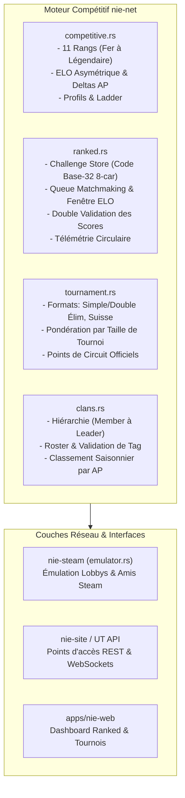

# Inazuma Eleven VR — Spécification E-Sport & Compétition Officielle (`nie-net`)

Cette documentation consigne l'architecture, les règles de calcul mathématique, les formats de tournois, la gestion des clans et les protocoles de matchmaking ranked pour Inazuma Eleven Victory Road dans le monorepo `aphrody-code/nie`.

Elle unifie l'ingénierie inversée de `nie.exe` et l'intégration du moteur compétitif Achillea de Rose Griffon (`apps/achillea-bot/src/services`, `src/api`, `src/ranked`).

---

## 1. Vue d'Ensemble de l'Architecture Compétitive

Le sous-système compétitif e-sport est logé au cœur de [`crates/engine/nie-net`](file:///home/ubuntu/niers/crates/engine/nie-net) :



---

## 2. Rangs Compétitifs & Calcul de l'ELO (`competitive.rs`)

### 2.1 Les 11 Paliers de Rangs (Rank Tiers)

L'échelle compétitive standard comporte 11 rangs échelonnés de 0 à plus de 2000 AP (Achillea Points / Activity Points) :

| Index | Rang | Nom FR | Nom EN | Intervalle AP | Facteur K Victoire | Facteur K Défaite |
|:---:|:---|:---|:---|:---:|:---:|:---:|
| `0` | `Fer` | Fer | Iron | 0 – 199 AP | +20 | -5 |
| `1` | `Bronze` | Bronze | Bronze | 200 – 399 AP | +20 | -8 |
| `2` | `Argent` | Argent | Silver | 400 – 599 AP | +20 | -10 |
| `3` | `Or` | Or | Gold | 600 – 799 AP | +20 | -12 |
| `4` | `Platine` | Platine | Platinum | 800 – 999 AP | +20 | -14 |
| `5` | `Diamant` | Diamant | Diamond | 1000 – 1199 AP | +18 | -14 |
| `6` | `Émeraude` | Émeraude | Emerald | 1200 – 1399 AP | +18 | -15 |
| `7` | `Rubis` | Rubis | Ruby | 1400 – 1599 AP | +18 | -16 |
| `8` | `Divin` | Divin | Divine | 1600 – 1799 AP | +16 | -16 |
| `9` | `Supernova` | Supernova | Supernova | 1800 – 1999 AP | +16 | -16 |
| `10` | `Légendaire` | Légendaire | Legendary | 2000+ AP | +16 | -16 |

### 2.2 Asymétrie et Équité Mathématique

Le système utilise une espérance mathématique logistique classique combinée à une asymétrie directionnelle par palier :

$$E_A = \frac{1}{1 + 10^{(R_B - R_A) / 400}}$$

$$E_B = 1 - E_A$$

Le delta AP est calculé de manière progressive :
- **En cas de Victoire ($S = 1.0$)** : $\Delta = \mathrm{round}(K_{\mathrm{win}} \times (1 - E_A))$
- **En cas de Défaite ($S = 0.0$)** : $\Delta = \mathrm{round}(K_{\mathrm{loss}} \times (0 - E_A))$
- **En cas de Match Nul ($S = 0.5$)** : $\Delta = \mathrm{round}(K_{\mathrm{base}} \times (0.5 - E_A))$

> [!NOTE]
> Les paliers inférieurs (Fer, Bronze) protègent les joueurs débutants contre la déflation d'AP (-5 AP minimum sur une défaite en Fer pour +20 AP max sur une victoire), tandis que les hauts rangs (Divin à Légendaire) appliquent une stricte symétrie ($\pm 16$) requérant un ratio de victoire positif constant pour progresser.

---

## 3. Matchmaking Ranked & Salle de Match (`ranked.rs`)

### 3.1 Codes de Défi Instantanés (`ChallengeStore`)
Pour organiser des matchs de tournoi ou des défis amicaux sans friction, le système génère des codes de 8 caractères :
- **Alphabet Base-32 non ambigu** : `ABCDEFGHJKLMNPQRSTUVWXYZ23456789` (exclusion des caractères confus `0`, `1`, `I`, `O`).
- **Durée de vie (TTL)** : 30 minutes (1800 secondes).
- **Consommation unique** : Un code utilisé est immédiatement invalidé pour éviter les doublons de session.

### 3.2 File d'Attente & Élargissement Dynamique de Fenêtre ELO
La recherche d'adversaire adapte la tolérance d'ELO au temps passé dans la file :

$$\mathrm{Window}(t) = W_{\mathrm{base}} + \left\lfloor \frac{t_{\mathrm{attente}}}{5000\,\mathrm{ms}} \right\rfloor \times 50\,\mathrm{AP}$$

- Fenêtre initiale par défaut : $\pm 100\,\mathrm{AP}$.
- Croissance : $+50\,\mathrm{AP}$ toutes les 5 secondes.
- Garantie formelle d'exclusion de soi-même (`user_id_a != user_id_b`).

### 3.3 Double-Validation & Résolution des Scores
À l'issue du match, chaque joueur soumet son relevé de score :
- **Validation mutuelle** : Si Joueur A déclare $(G_A, G_B)$ et Joueur B déclare $(G_B, G_A)$ (avec $G \in [0, 99]$), le score est immédiatement certifié et le match passe à `Finished`.
- **Litige (Dispute)** : En cas de divergence de score, le statut bascule sur `Disputed` et déclenche une entrée dans le journal de télémétrie pour arbitrage.
- **Forfait automatique (Timeout)** : Si un seul joueur soumet un score valide et que le second joueur ne répond pas dans le délai imparti, le match est validé par forfait au bénéfice du joueur actif.

---

## 4. Tournois & Arbres Compétitifs (`tournament.rs`)

### 4.1 Formats Supportés
1. **Single Elimination** : Arbre direct à élimination simple.
2. **Double Elimination** : Double tableau avec Winners Bracket, Losers Bracket et Grande Finale.
3. **Swiss Stage** : Rondes suisses avec appariement basé sur le score (victoires/défaites) sans élimination directe précoce.

### 4.2 Points de Circuit & Pondération par Taille

Les tournois attribuent des points de circuit pour le classement saisonnier officiel. Ces points sont pondérés par le multiplicateur de participation :

| Nombre de Participants | Multiplicateur Taille |
|:---:|:---:|
| 1 à 7 joueurs | $0.5\times$ |
| 8 à 15 joueurs | $0.75\times$ |
| 16 à 31 joueurs | $1.0\times$ (Référence) |
| 32 à 63 joueurs | $1.25\times$ |
| 64 à 127 joueurs | $1.5\times$ |
| 128+ joueurs | $2.0\times$ |

Attribution de points de base par palier de classement dense :
- **1er (Champion)** : 100 points
- **2e (Finaliste)** : 70 points
- **3e – 4e (Demi-finalistes)** : 45 points
- **5e – 8e (Quarts de finale)** : 25 points
- **9e – 16e (Huitièmes de finale)** : 10 points

---

## 5. Système de Clans & Clubs (`clans.rs`)

Les joueurs peuvent s'organiser en clubs pour le classement inter-équipes :
- **Tag d'Équipe** : Validé sous le format `[TAG]` (2 à 5 caractères alphanumériques).
- **Rôles hiérarchiques** :
  - `Member` (0) : Membre régulier.
  - `Officer` (1) : Droit d'inviter et de modérer.
  - `CoLeader` (2) : Droits administratifs et gestion des tournois.
  - `Leader` (3) : Propriétaire fondateur du club.
- **Classement de Clan** : La somme des contributions individuelles en AP alimente le score du club et positionne le clan sur le leaderboard saisonnier.

---

## 6. Vérification & Couverture des Tests

Les tests unitaires et d'intégration couvrent l'intégralité du pipeline e-sport :
```bash
cargo test -p nie-net
```
- `test_rank_tier_resolution` : Validation du passage des 11 paliers de rang.
- `test_tier_elo_factors_asymmetry` : Vérification de la protection asymétrique des débutants.
- `test_compute_match_elo_updates` : Test d'intégration de progression ELO.
- `test_challenge_store_flow` : Génération, expiration et consommation des codes base-32.
- `test_queue_pair_selection` : Simulation de file d'attente avec élargissement dynamique.
- `test_score_double_validation_agree` / `dispute` : Scénarios d'accord mutuel et de litige.
- `test_tournament_full_lifecycle` : Cycle complet d'inscriptions, check-in, arbre et attribution de points.
- `test_clan_lifecycle_and_contributions` : Création de club, ajout de membre et cumul d'AP.
