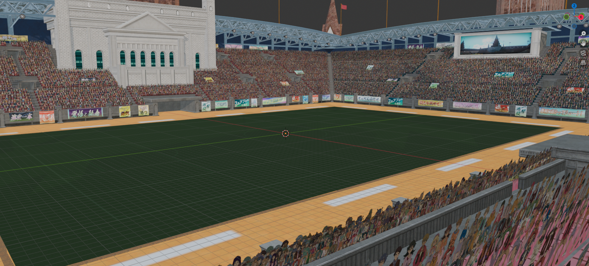
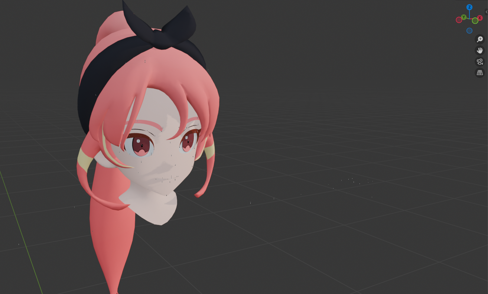
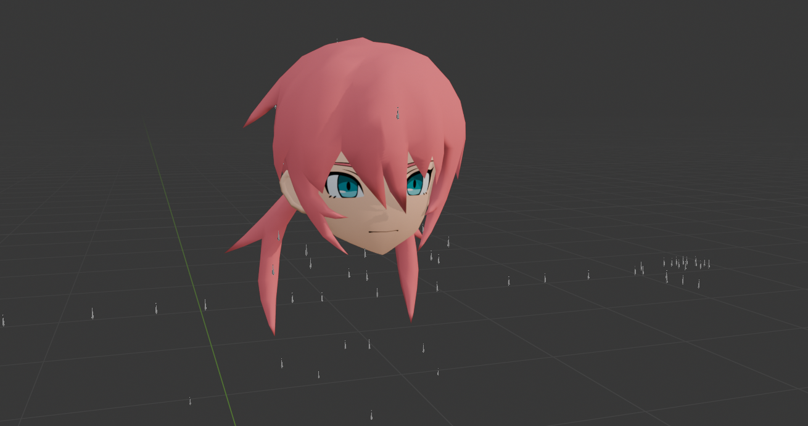

# Level-5 G4 Blender Tools

Blender add-on for importing Level-5 G4 assets and porting edited geometry back to conservative native packages. It supports models, characters, maps, animations, cameras, events and textures used by G4-based games.

The exporter patches a legally obtained native base instead of rebuilding unknown format tables from scratch. This preserves the original layout, material references, hashes, palettes and texture structure whenever possible.

An untouched model imported from its original G4MD is preserved byte-for-byte on export by default. **Preserve Untouched Native Import** copies its original G4MD, G4MG and G4TX files only when every assigned imported mesh still matches its import snapshot. Moving geometry, changing UVs or assigning a different source mesh automatically falls back to the normal port process.



## What it does

| Area | Capabilities |
| --- | --- |
| Models | Import individual assets or folders, create materials, extract textures and assign them automatically. |
| Characters | Build character rigs, resolve shared skeletons, attach modular body parts and preserve skin weights. |
| Maps | Reconstruct map placement, transforms and linked instances from world hierarchies. |
| Animation | Import G4MT motions, G4CM cameras, event folders, facial expressions and P3LIP lip-sync data. |
| Rendering | Recreate Level-5-style character materials, toon shading, authored recolour masks and outlines. |
| Porting | Export edited Blender or DAE geometry to native `G4MD`/`G4MG` pairs and update compatible `G4TX` archives. |

## Supported formats

| Format | Use |
| --- | --- |
| `G4MD` | Model files |
| `G4PKM` | Packed model containers |
| `G4SK` | Skeletons |
| `G4TX` | Texture archives |
| `G4MT` | Character animation |
| `G4CM` | Camera animation |
| `G4PK` | Animation containers |
| `NXTCH` | Nintendo Switch texture payloads |
| `P3LIP` | Lip-sync sequences |

## Installation

Install the release ZIP, or package the `G4_Blender` directory as a ZIP while keeping its folder name and `__init__.py` at the add-on root.

1. In Blender, open **Edit > Preferences > Add-ons**.
2. Choose **Install from Disk** and select the ZIP.
3. Enable **Level-5 G4 Blender Tools**.

The add-on is a single flat package. Its root `__init__.py` is the only entry point; the helper modules and `chara_model_lookup.json` must stay beside it.

### Menu entries

```text
File > Import > Level-5 G4 Model
File > Import > Level-5 G4 Model Folder
File > Import > Attach Level-5 G4 Character Parts
File > Import > Level-5 G4 Animation
File > Import > Level-5 G4 Camera
File > Import > Level-5 G4 Event Folder
File > Export > Level-5 G4 Port
View3D > Sidebar > Level-5 > G4 Port
```

## Importing assets

### Models and textures

Import a model directly from Blender, drag it into the viewport, or import a folder in batch. The add-on extracts compatible textures, builds materials and assigns them to the mesh. It also imports character and map assets with the appropriate material treatment instead of applying the character shader indiscriminately.

Map assets use the classic material mapping. Character assets receive a Level-5-style Eevee material with hard shadow bands, native normal-map decoding, recolour-mask controls, wetness and outline parameters. Source `COLOR` data is kept as **G4 Outline Parameters**, and the original line texture remains available as **G4 Line Parameter**.

### Character rigging




Character heads named `cXXXXXXXX` can be combined with separate components:

| Prefix | Part |
| --- | --- |
| `uXXXXXXXX` | Body |
| `sXXXXXXXX` | Shoes |
| `skXXXXXXXX` | Arms and neck, where available |
| `g`, `m`, `n` | Gloves, captain armband and nameplate |

Use the character-parts dialog during model or animation import, or select **Attach Level-5 G4 Character Parts** to add components to an existing rig. The importer never guesses a uniform from an ID: cancelling a body or shoes selection simply skips that part. Secondary LOD meshes are discarded so multiple LODs do not deform together.

Many character models reference a shared skeleton rather than embedding one locally. `chara_model_lookup.json` helps locate it, but the add-on still requires a complete legal game dump with the shared skeletons, typically under `data/common/chr/`. Joint names are resolved through the model's CRC32 palette, not by palette order or mesh shape, so modular parts can target the correct bones reliably.

`Apply Bone Orientation` is optional. It improves the visual orientation of imported bones but changes Blender local axes, so it is disabled by default. G4MT animation import preserves the original G4SK axes and replaces a previously reoriented selected rig with an animation-safe one when needed.

### Outlines and character parameters

The **Character Outline** preference has three modes:

| Mode | Result |
| --- | --- |
| **Detailed** | Default. Filtered silhouette plus selected authored seam details and viewport cavity lines. |
| **Simple** | Filtered silhouette and viewport outline only. |
| **Off** | Disables both outline paths. |

**Outline Thickness** controls the main silhouette in pixels; its default of `1.65` matches the game reference. Eye and mouth helper planes are excluded from contours. Authored line textures and low `COLOR.B` weights select the restrained secondary silhouette where appropriate.

Character meshes also receive a **Level-5 Character Parameters** Geometry Nodes modifier. It is added for character imports from `chr` even when a shared uniform part has no texture of its own, so externally controlled character shading remains available on modular bodies. Shared `_uniform` models also fall back to their family G4TX directory when no converted `chara_parts` lookup is present, letting standalone imports such as `u000101` resolve `u000101_20`/`u000101_30` texture sets and receive the Character shader. The modifier exposes saturation, brightness, light and shadow floors, normal strength, specular strength and wetness without requiring shader-graph edits. When the selected mesh uses the Character shader, the modifier context also shows labelled texture slots for the material's base, mask, normal, occlusion, line, specular and alpha image nodes. **Load Character G4TX** in the same modifier panel extracts a selected `.g4tx` into the import cache and loads its images into Blender; matching texture roles are assigned automatically when possible, otherwise the loaded images remain available for manual selection in the texture fields.

## Map reconstruction

For a complete map, select the world directory itself, such as `w10`, `w11` or `w12`, and enable recursive folder import. The importer reads the world-level `.g4pk` or `.g4pkm` hierarchy, matches scene nodes to model assets, composes transforms, converts G4 Y-up coordinates to Blender Z-up, and uses linked object data for repeated assets.

Auxiliary shadow and culling objects are hidden automatically. Models absent from the render hierarchy still import unchanged; the add-on does not invent placements for them. When present, a matching native half-float DDS cubemap is converted to equirectangular Radiance HDR and used as a restrained world environment.

## Animation and events

### G4MT and G4CM

Import G4MT motions onto a character rig and G4CM camera data into the scene. Animation rigs are aligned to their exact G4SK rest axes before actions are created, avoiding the bone-axis approximation of a Collada-only workflow. The importer retains the source timing, transforms and facial-scale behaviour while reducing only constant or near-linear samples.

### Event folders

**Level-5 G4 Event Folder** imports character animation G4PK files and the event G4CM from a directory. Each cut becomes a named Action and NLA strip, with markers for cut boundaries and one rig per actor. Disjoint source ranges retain their timing; overlapping alternatives are concatenated by cut number so Blender can represent them in one NLA scene.

When available, event configuration files provide actor placement links. The importer applies those placements, hides actors absent from a cut, reads per-cut lighting from `EventMap_fix` resources, imports matching event effects by default, and can use `.g4ma` sidecars for facial-expression atlas changes. It also creates separate P3LIP controllers for voice-line visemes when the selected language data is present.

Large events produce large Blender files because source transforms are sampled per frame to preserve G4 quaternion interpolation. This is expected. The add-on writes curves in bulk and omits channels with no animation, but memory and disk use still scale with actor count, bone count and duration.

For finished event scenes, use **File > Export > Level-5 G4 Scene (.fbx)**. It exports the scene animation without embedding textures, duplicating NLA strips as takes, exporting every Action or adding leaf bones. Avoid Blender's standard FBX preset for this workflow, as its all-actions mode can duplicate animation across rigs.

## Porting edited models

The port exporter writes edited Blender or DAE geometry into a native `G4MD`/`G4MG` pair. Start from a compatible original model from a complete legal game dump; that base defines the record structure, materials, palettes and texture archive the exporter can safely patch.

The exporter:

* Preserves native layouts, material references, hashes and record structure where possible.
* Resolves Collada skin controllers and Blender-exported weight sidecars.
* Validates generated records, palettes, indices and packed-weight sums before writing packages.
* Copies or rebuilds `G4TX` archives from the native base.
* Handles Nintendo Switch `NXTCH` texture payloads, with automatic `dx11` to `nx` fallback.
* Builds port settings from the selected original model rather than using model-specific bone presets.

### Texture replacement

Texture replacement is deliberate and non-destructive:

1. Assign each Blender mesh to its original G4MD record.
2. Open **Prepare and review atlas**, then choose **Prepare Atlas**. Review the destination G4TX texture, source state and whether the atlas is ready, stale or native.
3. Export. Optionally enable **Regenerate Atlas On Export** to refresh it automatically.

The default atlas source is the first diffuse image used by the mesh. **Atlas Source** lets you override it. Empty, stale or unreadable entries never write blank textures or UV-guide PNGs: the exporter removes only its failed generated atlas, logs a warning and keeps the native G4TX payload. Atlas cells are deterministic (record order, then object name), laid out left-to-right and top-to-bottom. Generated cells include a small edge gutter and transparent-pixel colour bleed so filtering does not create black outlines or sample a neighbour. Meshes that share the same normal source image share the exact same atlas-cell transform, preserving their authored relative UV placement; only meshes with repeated or out-of-range UVs receive an isolated projected cell and a fitted transform. Object UV tiles are exported only for a base texture that is actually replaced; native textures keep their original UVs. Enabling **Regenerate Atlas On Export**, **Use Object UV Tiles** or **Auto Pack Object UVs** is treated as an explicit atlas export and never falls back to a byte-for-byte native copy. `line`, `oc`, `sp` and `spm` maps are preserved unless **Replace Special Maps** is enabled *and* a valid source map exists; unavailable special maps never receive implicit solid-colour replacements.


`eye_10` and `mouth_10` share the native facial texture (`*_10`) and therefore never create a new base atlas. Generic replacement paths for that entry are ignored deliberately: they would invalidate its authored UV windows. A prepared atlas from another model can be accepted explicitly through **Existing 4x2 Atlas** and **Use Existing 4x2 Atlas**. Alternatively, initialize **Expression pool**, provide eight images in row-major order (Cell 1–4 are the top row; 5–8 the bottom row), then choose **Build 4x2 Expression Atlas**. A pool maps the source face and mouth into Cell 1 (top-left); an accepted existing atlas leaves their authored UV windows intact. Both routes replace only the shared facial G4TX entry; until then, its native payload is preserved.

Atlas diagnostics are written to `atlas_uv_trace.log` in the configured export cache. It lists each source image, UV bounds, atlas cell, scale and offset, then appends the exact converter command and its output. Analysis/export reports also include `uv_transform_trace` for every generated native record.

Atlas offsets are authored in Blender image space and converted automatically when the G4 V flip is enabled, so the visible top row remains the top row in the exported model.

## Requirements

* Blender 4.0 or newer
* Python 3.10 or newer
* Pillow available to Blender/Python when rebuilding custom textures

## Disclaimer

This independent community tool is intended for interoperability, research and modding. It contains no original game models, textures, animations, audio or other playable assets. The included lookup database is derived from game metadata solely to support automatic skeleton resolution and rigging.

Provide your own legally obtained game files. This project is not affiliated with, endorsed by or associated with Level-5.

## Special thanks

* **TheWonderVal** — outline logic, rigging testing and bug reporting.
* **KatamariEnjoyer** — testing and bug reporting.
* **daniguay87** — rigging testing and bug reporting.
* **DaRk_Proaso** — porting testing.
* **DaniKH** — batch-importing and shading support, rigging testing and bug reporting.
* **Victory Road España**.
